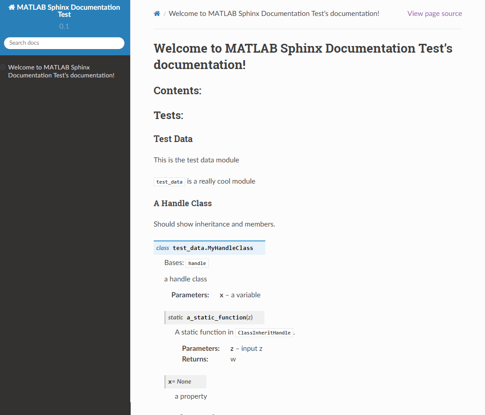

# simpleMatlabSphinxDemo
A simple example of documenting Matlab by sphinx 

### References
1. [Sphinx - How to generate documentation from python doc strings - Five + Minutes on Tips and Tricks](https://www.youtube.com/watch?v=BWIrhgCAae0&t=338s)
2. [How to properly document matlab code](https://devanginiblog.wordpress.com/2015/11/16/how-to-properly-document-matlab-code/)
3. [sphinx-contrib](https://github.com/sphinx-contrib/matlabdomain)

### Input
check the folder `test_data`

### Output
check the folder `test_docs/_build/html/index.html`

